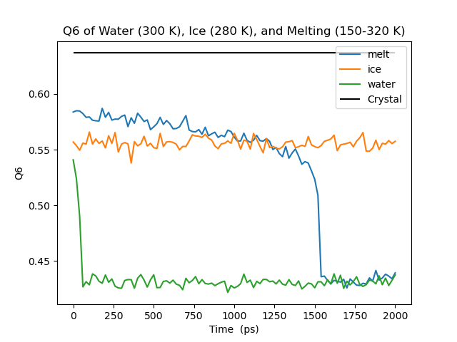
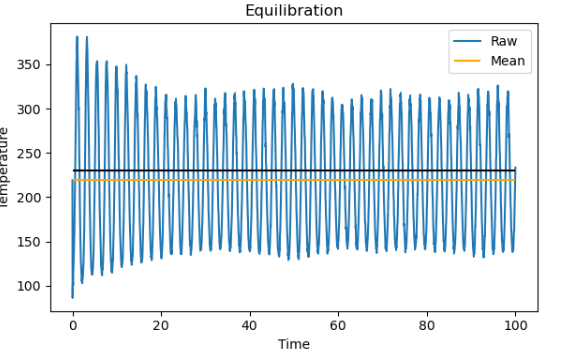
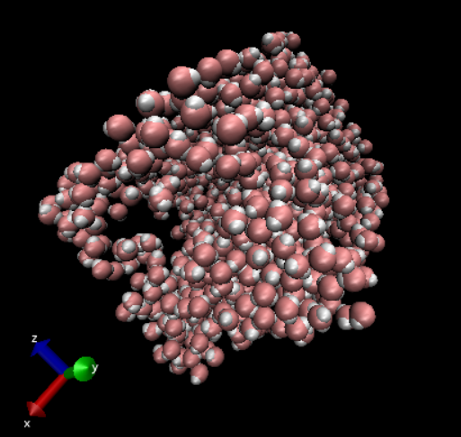

# Project 3: Identifying the Melting Temperature of Different Models of Ice Using Gromacs
In this github I am going to be providing all my code, workflow, and analysis that I used to identify the melting temperature of TIP4P (for this project).
|      | My Work   | Literature [1](https://pubs.aip.org/aip/jcp/article/124/14/144506/929132/The-melting-point-of-ice-Ih-for-common-water)|
|-----:|-----------|-----------|
| TIP4P| 300       | 229 (2)   |

## Overview
I started with a perfect crystal of ice which was generated from 🚨 link here
For this project I ran 2 minimization and 1 equilibration step that did not change, the production step had several variations. 
1. Minimization
2. Equilibration: for the equilibration step I did the temperature and the pressure equilibration together (see **Trouble Shooting** section for details)
3. Production
For the analysis, I looked at Q6 and the potential energy.

### Running the code
To run this code on Borah, upload the inputs file, navivagate to the inputs folder, and type `sbatch submit.sh`. If you want to run the ice or water production change the corresponding lines in the `submit.sh` file.

## Input Files
### .mdp
To see all the .mdp options see the mdp folder.

#### eql.mdp
The [equilibrate](mdp/eql.mpd), [equilibrate warm](mdp/eql_warm.warm), and [equilibrate hot](mdp/eql_hot.mdp), will equilibrate the system to 150 K, 280 K, and 300 K respectively. I used these for the production run, ice run, and the water run (note 300K did not quite melt the ice in the equilibration run).
#### prd.mdp
The [production](mdp/prd.mpd) will ramp the temperature from 150-330K over 1E6 time steps. While the [production](mdp/prd_ice.mpd), and [production](mdp/prd_water.mpd) well keep the temperature steady at 280K and 300K respectively.
### Topology
The topology was created using [this](https://colab.research.google.com/github/vitroid/GenIce/blob/main/jupyter.ipynb) google collab, but I only needed a few lines:

```
%pip install genice2 genice2-svg genice2-cage
%pip install genice2-mdanalysis
exit(0)
```
and
```
from genice2.genice import GenIce
from genice2.plugin import Lattice, Format, Molecule

lattice = Lattice("ice1h_unit")
formatter = Format("mdanalysis")
water = Molecule("spce") # Modift this line to get the output you want I used TIP4P
universe = GenIce(lattice, reshape=[[4, 0, 0], [0, 4, 0], [0, 0, 4]]).generate_ice(
    formatter, water=water)
# Save as a .gro file.
allatoms = universe.select_atoms("all")
allatoms.write("conf.gro")
```
afterward I needed to modify the .gro file so the atom types matched my .itp file you can see my conf.gro file [here](inputs/conf.gro).
### itp file
The .itp file is from the `oplsaa.ff` folder from the gromacs library, and my exact version can be found [here](info/tip4p.itp)
## Anaylsis
### Potential Energy
### Q6
Looking at the Q6 parameter of the water, we see that A pure crystal has a Q6 of 0.63, ice has a Q6 above 0.55, and water is below 0.45.


### Deccorrelation Time

## Gromacs Version and Specifications
### Borah Specifics
For the build instructions see [this text file](info/gromacs_specs.txt).
#### Loading Modules
`module load gromacs+plumed/2024.5/openmpi/4.1.3/gcc/12.1.0`

`which gmx_mpi`: `/cm/shared/apps/gromacs+plumed/2024.5/openmpi/4.1.3/gcc/12.1.0/bin/gmx_mpi`

`which plumed`:`/cm/shared/apps/plumed/2.9.3/openmpi/4.1.3/gcc/12.1.0/bin/plumed`

`gmx_mpi --version`: See [This text file](info/gromacs_specs.txt).

#### Gromacs Commands
`gmx_mpi energy -f prd.edr -o prd`
This puts out an .xvg file, that contains whatever info you ask it for, I typically asked for PE, KE, T, Pressure, Density, and System T.
##### gro-step
There are 2 main commands in gro-step, the `grompp` command, which will create the job, and the `mdrun` command which will run the job. Please note that the options for the `mdrun` command can all be replaced with `-defnm ${JOB}`. Also at the begining of the file I have the command `JOB=$1`.

`mpirun -np 1 -npernode 48 gmx_mpi grompp -f ${JOB}.mdp -c $STRUCTURE -o ${JOB}.tpr -pp ${JOB}.top -po ${JOB}.mdp`

`mpirun -np 1 -npernode 48 gmx_mpi mdrun	-s ${JOB}.tpr	-o ${JOB}.trr	-x ${JOB}.xtc	-c ${JOB}.gro	-e ${JOB}.edr -g ${JOB}.log`

To use this in a submit make sure you have a `conf.gro`, as well as a `job.mdp` file, and then you can use `bash gro-step job`.
##### submit script
In my submit script I am exporting `GMXLIB=$HOME/GMXLIB`, this is will be different on you machine depending on were your gromacs data is. You can also see the [submit](inputs/submit.sh) to get the nodes requested, time allocation for the job, and other submission script specifications. If you don't use Borah these will be different.

#### Plumed Commands
To get the Q6 you can use the [plumed.dat](info/plumed_xtc.dat) file to get your outputs

`plumed driver --plumed plumed_xtc.dat --mf_xtc prd.xtc`
### Make Specifications

## Trouble Shooting
### Ringing with Temperature Equilibration
Shown in the image below we can see *ringing* in the temperature as I am trying to equilibrate the system. This oscillation does not diminish even over long simulation times (the mosth I tried was 1E6 steps). This caused the system to melt long during the equilibration step which made it impossible to do the analysis I wanted to.

### Finding the Barostat
Using the `Parrinello-Raham` barostat for the initial equilibration caused some issues, as can be seen here: 

Attempting to use the `berendsen` barostat caused gromacs to have a warning, and I could use it without turning on the `max_warn` option. It said instead to use the `C-rescale` barostat, which it said was good for both equilibration and production runs. I do not have a good enough understanding of barostats to evalulate this statement. I decided to go with the `C-rescale` barostat for all of my equilibration and production runs as it seemed to work fine. 
### Superheating
At first I was a little concerned that my temperatures did not match the [literature values](https://pubs.aip.org/aip/jcp/article/124/14/144506/929132/The-melting-point-of-ice-Ih-for-common-water), however the paper I read said that it was possible to superheat solids if there was no interface. [Another paper](https://www.tandfonline.com/doi/abs/10.1080/00268970412331293820), said that the superheating is usually on the of about 90 K, which about matched the results I got. 

## References
* VMD
* Gromacs
* Plumed
* [The range of meta stability of ice-water melting for two simple models of water](https://www.tandfonline.com/doi/abs/10.1080/00268970412331293820)
* [The melting point of ice for common water models calculated from direct coexistence of the solid-liquid interface](https://pubs.aip.org/aip/jcp/article/124/14/144506/929132/The-melting-point-of-ice-Ih-for-common-water)
* [GenIce2](https://github.com/vitroid/GenIce)
  * [Collab](https://colab.research.google.com/github/vitroid/GenIce/blob/main/jupyter.ipynb)
